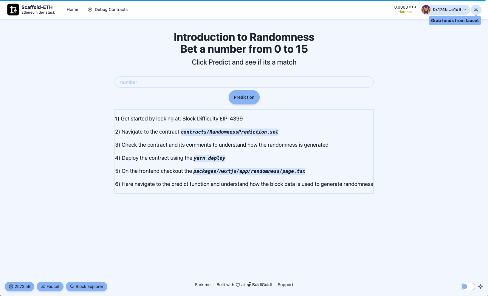

# Randomness Introduction



This Scaffold-ETH 2 extension comes pre-configured with RANDOMNESS generator contract and frontend to interact with it 

## Installation
```bash
  npx create-eth@latest -e bhavyagor12/randomness-extension
```
## Usage

This extension supports both `foundry` and `hardhat` so choose any.

- For Foundry (add this to the package.json)
- Copy the `script/DeployRandomness.s.sol` and `script/Deploy.s.sol` to your project

## Documentation

[Ethereum PoS introduces randomness using block.difficulty](https://eips.ethereum.org/EIPS/eip-4399)

[Dice Game using RANDAO](https://app.buidlguidl.com/build/NpGDQHQ1140K9QaG5kth)

[Solidity deep dive](https://soliditydeveloper.com/prevrandao)

[Stack exchange discussion](https://ethereum.stackexchange.com/questions/143504/blockhash-and-block-timestamp-manipulation-in-pos)
## Authors

- [@bhavyagor12](https://www.github.com/bhavyagor12) | bhavyagor.eth
